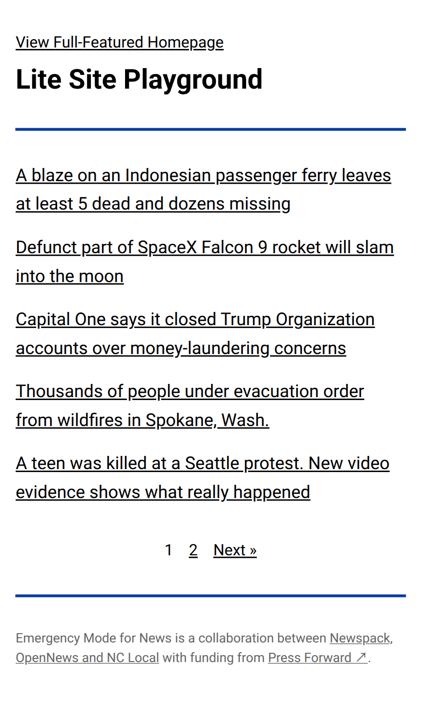
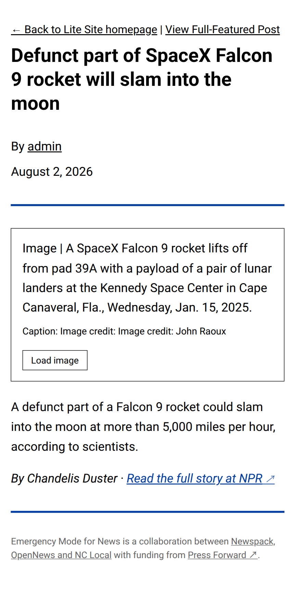
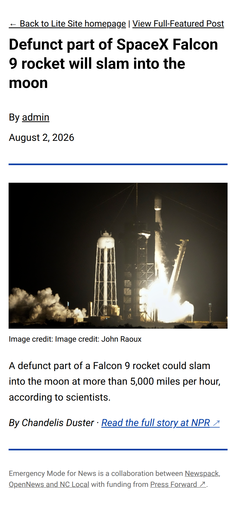
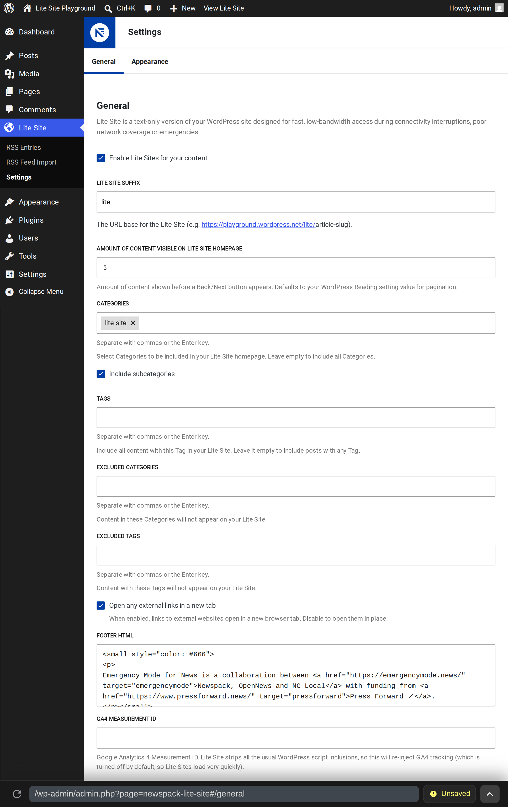
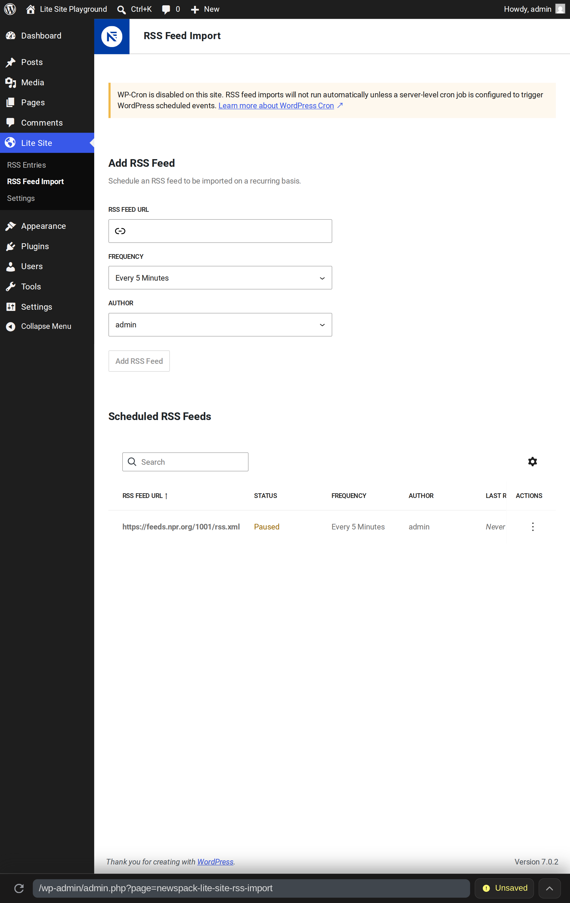
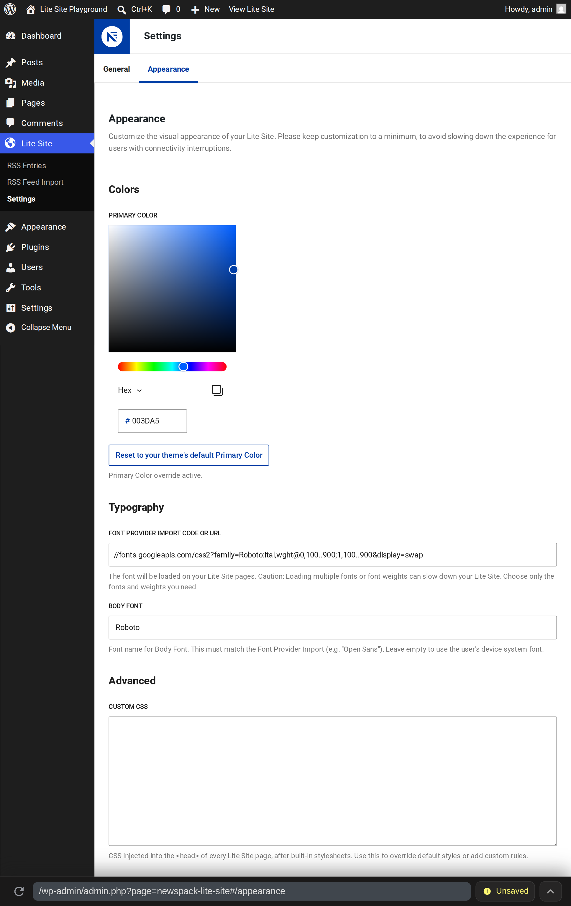

# Lite Sites

[](https://playground.wordpress.net/?blueprint-url=https://raw.githubusercontent.com/Automattic/newspack-lite-site/trunk/blueprint.json)

| Detail | Value |
| --- | --- |
| From | [Newspack](https://newspack.com/) and [Emergency Mode for News](https://emergencymode.news/) |
| Requires at least |  |
| Tested up to |  |
| Requires PHP |  |
| License |  |
| Stable tag | [(see package.json)](package.json#L3) |
| Changelog | [Changelog](https://github.com/Automattic/newspack-lite-site/blob/trunk/CHANGELOG.md) |
| Sponsor | [Press Forward](https://www.pressforward.news/infrastructure25/) |
| Contributors | [@automattic](https://github.com/automattic), [@newspack](https://github.com/newspack) &amp; [@miguelpeixe](https://github.com/miguelpeixe), [@rtcamp](https://github.com/rtcamp), [@scottklein](https://github.com/scottklein), [@tiffehr](https://github.com/tiffehr) |

## README MENU

- [Description](#description)
- [Background](#background)
- [Lite Sites Features](#lite-sites-features)
- [Known Limitations](#known-limitations)
- [Installation](#installation)
- [FAQ](#faq-frequently-asked-questions)
- [Troubleshooting](#troubleshooting)
- [Reports or Contributions](#reports-or-contributions)
- [License](#license)

## Description

Lite Sites is a WordPress plugin developed by Newspack and released to all WordPress users through the Emergency Mode for News initiative. It creates a stripped-down, **text-only version of your website** that loads rapidly even when bandwidth is severely compromised—making critical information accessible during network failures, disasters and other emergencies.

> [!IMPORTANT]
> **Try it now!** [Launch Lite Sites in a temporary WordPress Playground](https://playground.wordpress.net/?blueprint-url=https://raw.githubusercontent.com/Automattic/newspack-lite-site/trunk/blueprint.json)

Think of it as the digital equivalent of keeping a transistor radio for emergencies: 📻 **it works when everything else fails**.

This alternate Lite Site provides a stripped-down, basic HTML document with inline CSS — no theme, no Blocks runtime, no tracking scripts and no images _unless_ the reader taps to load one.

With some planning, it can also help address:

- breaking-news traffic spikes that overwhelm hosting
- satellite or dial-up connections
- readers on a metered plan
- low-vision-optimized renderings and other accessibility improvements

Lite Sites publishes via a domain suffix like `<your-site.com>/lite/`, `<your-site.com>/text/` or other domain variations you configure. On WordPress the domain path you choose will be added automatically. However, you could mask that pattern via any subdomain or other pattern you prefer via your hosting provider's records.



## Background

Lite Sites began as a [Newspack-hosted feature](https://help.newspack.com/lite-site/) and available to Newspack Publishers who needed text-only options during disasters.

This repository is the **rebuilt, public version**. It was upgraded and opened to all WordPress users through the [**Emergency Mode for News**](https://emergencymode.news/) grant, made possible by an infrastructure grant from [Press Forward](https://www.pressforward.news/infrastructure25/), a national initiative to reimagine local news.

The [Emergency Mode for News](https://emergencymode.news/) program provides free resources, training and open-source tools including this Lite Site plugin and a [modern liveblogging plugin](https://github.com/Automattic/newspack-rolling-coverage). Project goals, technical upgrades and the rationale for taking it public are described at [emergencymode.news](https://emergencymode.news/tools/#lite-sites).

**What changed with this new version:**

- Packaged as a standalone WordPress plugin
- A new **RSS Feed Import** system, so a Lite Site can aggregate and republish coverage from partner newsrooms during an emergency
- A React-based admin (built on `@wordpress/dataviews`) replacing the original settings screen
- Appearance controls (brand color, fonts, footer, custom CSS) so a Lite Site still reads as yours
- An **offline page** for sites running a service worker via the PWA plugin

## Lite Sites Features

### Text-only rendering

- Serves every eligible Post and Page, and your reverse-cron full archive as a text-only site alternative
- Simplifies standard WordPress content via a strict allowlist of elements — headings, paragraphs, lists, blockquotes, links and basic emphasis
  - Strips `<script>` tags and HTML comments entirely
  - Converts every `<figure>` into a **tap-to-load placeholder** showing the alt text and caption — images or interactivity downloads only on direct reader action  
  
    
- Each Lite Site article links back to the full-featured version and declares it as `rel="canonical"`, with `noindex, follow` so the Lite Site version never competes with the original
- Displays author bylines and publication dates on single posts, with support for co-authors
- Sticky posts are visually highlighted in the archive with heading-level emphasis

### Content controls

Choose the categories and tags that appear on the Lite Site, with optional automatic inclusion of subcategories for complex taxonomies.



- Configurable URL base, so `/lite` can become `/text`, `/fast` or anything else
- Configurable Pagination, defaulting to your WordPress **Settings → Reading** value
- Filter what appears within the Lite Site by including/excluding Categories and/or Tags
- Footer HTML, for your copyright and legalese
- Toggled behavior changes for external links
  - Open in new tabs and/or style them to convey that link _away_ from a text-only option (a `.lite-site-external` class[^2])
- An opt-_in_ field for setting a Google Analytics GA4 Measurement ID (not included from your site's default settings)

The display defaults to a reverse-chronology feed of Posts or Pages, with configurable pagination enabled for users to read deeper than the first `X` entries. Rendered Posts or Pages are cached in a transient for 15 minutes and cache is busted when the published Post or Page is saved.

### Alternative RSS Feed import



If your organization uses a different CMS than WordPress, you can provide any RSS Feed to the Lite Sites plugin. However, you will need to setup an alternative or "shadow" WordPress.com (`<your-site>.wordpress.com/text/`) or other WordPress instance (`alt.<your-site>.com/text/`) in order to run an RSS-driven Lite Site.[^1] Then you can install this plugin and configure it to populate with the contents of your external RSS Feed.

Once connected via Lite Sites, your alternative WordPress site will import the specified RSS Feed at the interval you choose and create a copy of your Feed items as WordPress Posts. Those Posts will then be published to as your Lite Site.

Using your RSS Feed, you can continue to use your own CMS and "dual-publish" to a simple WordPress backup site.

#### Details

- Add any number of RSS feeds, each with its own import interval (minimum every 5 minutes) and assigned WordPress author
- Pause, resume and delete feeds from the admin — each feed shows its last run, last result and next scheduled run
- Feed reprocessing never creates duplicates
- Feed-defined images or similar assets are sideloaded
- Secure:
  - every outbound URL is validated against private, reserved and link-local address ranges
  - Redirects and responses capped
  - Imports are limited to 50 new items per run and guarded by a per-feed lock

Feed imports run on WP-Cron. If your site defines `DISABLE_WP_CRON`, the admin will tell you and you'll need a system cron calling `wp-cron.php`.

### Simplified Appearance Options

Given the focus on low-bandwidth performance, brand styling is extremely limited.



You are able to control:

- Primary color (defaults to your current Primary)
- A Font Provider import URL and body font selection
- Limited custom CSS

## Known Limitations

Lite Sites works with most WordPress setups, but some configurations may cause conflicts:

| Setup Feature | Details to look for |
|---------------|---------------------|
| **Custom post types** | Only standard Posts and Pages are supported. Custom post types won't appear unless filtered through categories or tags. |
| **Advanced block types** | Complex blocks (embeds, interactive elements, custom blocks) are stripped to basic HTML. Only headings, paragraphs, lists, blockquotes, links and basic formatting survive. |
| **Redirect plugins** | Plugins that aggressively redirect or rewrite URLs (Redirection, Simple 301 Redirects) may interfere with `/lite/` URLs. Test after activating redirect plugins. See [Troubleshooting](#lite-or-equivalent-showing-404). |
| **Membership/paywall plugins** | Content restrictions may not carry over to Lite Site URLs. Test that protected content remains protected. |
| **Multilingual plugins** | WPML, Polylang and similar plugins are untested. Language-switching may not work correctly on Lite Site URLs. |
| **Page builders** | Content created with page builders (Elementor, Divi, Beaver Builder) will be heavily simplified. The plugin extracts only text content. |

If you encounter a conflict, check the [Troubleshooting section](#troubleshooting) first, then [report it as an issue](https://github.com/Automattic/newspack-lite-site/issues).

## Installation

### Install from a ZIP (recommended)

1. Download [**newspack-lite-site.zip**](https://github.com/Automattic/newspack-lite-site/releases/latest/download/newspack-lite-site.zip), which always points to the most recent release

    1. To install an earlier version instead, grab its ZIP from the [Releases](https://github.com/Automattic/newspack-lite-site/releases) page

1. In WordPress, go to **Plugins → Add New → Upload Plugin**, choose the ZIP and click **Install Now**
1. After installation completes, click **Activate Plugin**
1. Continue with [Admin Setup](#admin-setup)

To update later, repeat the same steps with a newer ZIP — WordPress will replace the existing copy and your settings and imported Posts are preserved.

### Install from source

You only need this method if you want to alter code or try something that has not been released yet. If you just want to run Lite Sites on a site, the ZIP instructions above are the better path.

The source in this repository is **not** ready to install as-is, because the Admin components must be compiled first.

<details>
<summary><strong>What you need first</strong></summary>

These are the tools that do the compiling. Each links to its own install instructions:

- [**Node.js**](https://nodejs.org/) — use the current LTS release. This builds the admin screens
- [**Composer**](https://getcomposer.org/download/) — a PHP dependency manager. This repository has no PHP libraries to download, but Composer still has to generate the file the plugin loads at startup
- **A copy of the source code.** Either [**Git**](https://git-scm.com/downloads), or no extra tool at all — see the two options below

You will run a few commands in a terminal (Terminal on macOS/Linux, or PowerShell/Windows Terminal on Windows). Every command below is meant to be copied and pasted as written.

</details>

#### 1. Get the source code

Pick which option is easier for you: GitHub download or `git clone`.

<details>
   <summary><strong>Option details</strong></summary>

   **Option A — download it from GitHub, no Git required.** On the [repository page](https://github.com/Automattic/newspack-lite-site), click the green **Code** button, choose **Download ZIP** and unzip it wherever you keep projects. The unzipped folder will be named `newspack-lite-site-trunk`; rename it to `newspack-lite-site`, since WordPress expects that name.

   **Option B — clone it with Git.** This makes it easier to pull in later updates:

   ```bash
   git clone https://github.com/Automattic/newspack-lite-site.git
   ```

</details>

#### 2. Build the plugin

In your terminal, move into the folder you just created and run both commands:

```bash
cd newspack-lite-site       # move to this directory
composer install --no-dev   # creates vendor/autoload.php, which the plugin requires on load
npm ci && npm run build     # compiles the React admin screens into dist/
```

If you plan to run the linters or tests described under [Contributing](#contributing-code), omit `--no-dev` so the developer tooling installs as well.

#### 3. Point WordPress at it

WordPress finds plugins by looking in the `wp-content/plugins/` folder inside your WordPress installation. The built folder has to end up there, under the name `newspack-lite-site`.

**If your WordPress runs on this same computer** (Local, MAMP, Docker, `wp-env`, etc.), choose from copying over the directory or symlinking it.

<details>
<summary><strong>Option details</strong></summary>

```bash
# Option 1: Copy the folder -- simplest, but after you copy it,
# you may not see your code changes
cp -r newspack-lite-site /path/to/wordpress/wp-content/plugins/

# Option 2: Symlink it, so WordPress reads your working
# folder directly and every edit shows up immediately
ln -s /path/to/newspack-lite-site /path/to/wordpress/wp-content/plugins/newspack-lite-site
```

Replace `/path/to/...` with the real locations on your machine. Then go to **Plugins** in your WordPress admin and activate **Lite Sites**.

A symlink is a pointer rather than a second copy of the files. Some hosts and some Windows setups disallow them, in which case use Option 1.

</details>

If your WordPress runs on a server somewhere else, package the built folder into a ZIP and upload it the same way as a release:

1. Build the ZIP:

   ```bash
   npm run release:archive # writes release/newspack-lite-site.zip
   ```

1. In your WordPress admin, go to **Plugins → Add New → Upload Plugin**
1. Choose the `release/newspack-lite-site.zip` file and click **Install Now**
1. After installation completes, click **Activate Plugin**

### Admin Setup

1. Activating Lite Sites will add a new entry to your Admin Toolbar called Lite Site
1. Go to **Lite Site → Settings**
1. Turn on **Enable Lite Site** and Save
1. Options

    - Edit the URL base
    - Add category and tag filters to find the content mix you want
    - Configure pagination you prefer to see
    - Set appearance/branding options

1. Visit `https://<your-site.com>/lite/` or your revised URL
1. Optionally, add feeds under **Lite Site → RSS Feed Import**

Link to `/lite` from your main site's header or footer so readers can find it before they need it.

## FAQ (Frequently Asked Questions)

### Will this affect my SEO?

No. Every Lite Site page includes a `rel="canonical"` link pointing back to your full-featured version and is marked with `noindex, follow` meta tags. This means:

- Search engines will index only your main site, never the `/lite/` versions
- The canonical tag tells search engines which version is authoritative
- The `follow` directive ensures links from Lite Site pages still pass authority
- Your `/lite/` URLs won't compete with or dilute your main site's rankings

The Lite Site is invisible to search engines but fully accessible to readers who need it.

### How much bandwidth does this actually save?

Typically 90-95% reduction compared to a full WordPress site. A standard article page that loads 2-3 MB on your main site will typically deliver as 20-50 KB on the Lite Site.

What gets stripped down:

- **JavaScript**: No theme scripts, no block editor runtime, no analytics, no ads (~500KB-2MB saved)
- **CSS**: No theme stylesheets, just minimal inline styles (~50-200KB saved)
- **Images**: Deferred until reader taps to load (~500KB-5MB+ saved per page)
- **Fonts**: Optional; only loads if you configure a font import (~50-200KB saved)
- **Tracking & third-party scripts**: Completely stripped (~100KB-1MB saved)

<details>
<summary><strong>Savings example</strong></summary>
For a typical news article with 3-4 images, the savings break down roughly like this:

| Element | Standard Site | Lite Site | Savings |
|---------|--------------|-----------|---------|
| HTML + Content | 50 KB | 15 KB | 35 KB |
| CSS | 150 KB | 3 KB (inline) | 147 KB |
| JavaScript | 800 KB | 0 KB | 800 KB |
| Images | 2 MB | 0 KB (deferred) | 2 MB |
| Fonts | 100 KB | 0 KB (optional) | 100 KB |
| **Total** | **~3.1 MB** | **~18 KB** | **~3.08 MB (99%)** |

These savings mean the difference between a page that won't load on a compromised connection and one that loads in under 2 seconds even on 2G.
</details>

### Can I use this with caching plugins?

Yes — and it's highly recommended. Lite Sites already includes built-in transient caching (15 minutes), but adding a page caching plugin creates an additional performance layer that makes Lite Sites even faster. Subsequent requests serve the static cached version directly — no PHP execution needed.

Lite Sites respects standard WordPress cache-busting hooks, so when you update content, both the plugin's transient cache and your caching plugin's cache are purged automatically.

<details>
<summary><strong>Compatible caching plugins</strong></summary>

- **Full-page caching**: WP Super Cache, W3 Total Cache, WP Rocket, LiteSpeed Cache, Comet Cache, Cache Enabler
- **Object caching**: Redis, Memcached (improves transient storage performance)
- **CDN integration**: CloudFlare, Fastly or any CDN that works with your caching plugin choices

</details>

### What happens if I deactivate the plugin?

Your `/lite/` URLs will return 404 errors, but nothing else on your site is affected. Your main site continues to function normally.

#### What stops working

- All `/lite/` URLs become inaccessible (404 Not Found)
- RSS feed imports stop (WP-Cron scheduled tasks are unscheduled)
- The admin menu entry disappears

#### What stays intact

- All plugin settings are preserved in your database
- Posts imported via RSS Feed remain in your WordPress database as regular Posts
- No data is deleted — if you reactivate, everything returns exactly as you left it

#### To fully remove the plugin

Deactivation alone doesn't delete any data. If you want to completely remove Lite Sites and its data, go to **Lite Site → Settings** and manually delete any RSS feeds you configured. Deactivate the plugin via **Plugins**. Click **Delete** on the deactivated plugin to remove files and settings.

Alternatively, delete imported RSS Entries manually before uninstalling if you want to clean up those Posts from your database.

### Accessibility impact?

Lite Sites generally improve accessibility, especially for users with assistive technology, cognitive disabilities or limited bandwidth. But getting this version in front of those users in your audience may be a different challenge.

> [!TIP]
> Use the Lite Site as an emergency/bandwidth fallback, not a replacement for your main site's full accessibility features. For most readers using assistive technology in low-bandwidth situations, the Lite Site will be significantly more usable than a full site that won't load.

<details>
<summary><strong>Pros &amp; Cons</strong></summary>

#### Accessibility benefits

- Faster for screen readers: Less DOM complexity means faster navigation
- Cleaner semantic HTML: Stripped-down structure with proper heading hierarchy, lists and link text
- Better for cognitive disabilities: No animations, popups or visual distractions
- Keyboard navigation: Simplified layout with fewer interactive elements makes tab navigation more predictable
- Low-bandwidth assistive tech: Users relying on assistive technology over slow connections get reliable access
- High contrast by default: Minimal styling makes it easier to apply custom stylesheets or browser accessibility modes

#### Potential considerations

- ARIA labels removed: Complex block editor ARIA attributes are stripped during simplification, which is generally not an issue since the underlying semantic HTML remains
- Custom accessibility features lost: If your theme includes specialized accessibility enhancements like skip links, focus indicators, etc., those won't carry over to the Lite Site
- Alt text preserved: Image alt text appears in tap-to-load placeholders, so descriptive alt text remains accessible even when images aren't loaded

</details>

## Troubleshooting

### WP-Cron not running

RSS feed imports depend on WP-Cron. If feeds aren't importing on schedule:

1. Check if WP-Cron is disabled: Look in `wp-config.php` for `define('DISABLE_WP_CRON', true);`. If present, WP-Cron won't run automatically and you'll need system cron (see below).

1. Verify scheduled tasks exist: Install [WP Crontrol](https://wordpress.org/plugins/wp-crontrol/) to view all scheduled events. Look for `newspack_lite_site_rss_import` events—each active feed should have one scheduled.

1. Test manual execution: Visit `https://<your-wordpress-shadow-site>/wp-cron.php` directly in a browser. This triggers pending cron events. Check if your feed imports afterward under **Lite Site → RSS Feed Import**.

1. Set up system cron: See the [WordPress WP-Cron documentation](https://developer.wordpress.org/plugins/cron/) and [Hooking WP-Cron Into the System Task Scheduler](https://developer.wordpress.org/plugins/cron/hooking-wp-cron-into-the-system-task-scheduler/) for more details.

### Rewrite rules not flushing

If your `/lite/` URLs return 404 errors even after enabling the plugin:

1. Manually flush rewrite rules: Go to **Settings → Permalinks** in WordPress admin and click **Save Changes** without changing anything. This forces WordPress to regenerate all rewrite rules.

1. Check permalink structure: Lite Sites requires pretty permalinks. If your site uses "Plain" permalinks (`?p=123`), go to **Settings → Permalinks** and choose any other structure (Post name is recommended).

1. Deactivate and reactivate: Sometimes deactivating and reactivating the plugin triggers the rewrite rules to flush properly.

See the [WordPress Rewrite API documentation](https://developer.wordpress.org/reference/functions/flush_rewrite_rules/) for technical details or other options.

### RSS feeds not importing

If feeds aren't importing or show errors in **Lite Site → RSS Feed Import**:

1. Verify WP-Cron is running: RSS imports rely on WP-Cron. See the [WP-Cron troubleshooting section](#wp-cron-not-running) above.

1. Check the feed URL is valid: Copy the feed URL and open it in a browser. You should see valid RSS/XML content. If it redirects, times out, or shows an error, the feed itself is broken.

1. Review the "Last Result" in the admin: Under **Lite Site → RSS Feed Import**, each feed shows its last result. Common errors:
   - "Invalid feed URL": The URL format is malformed or blocked by security validation
   - "Feed fetch failed": The remote server is unreachable, blocking your WordPress site, or returned an error
   - "No valid items found": The feed parsed successfully but contained no importable content

1. Check for security restrictions: Lite Sites blocks feeds from private/reserved IP ranges (`localhost`, `192.168.x.x`, `10.x.x.x`, etc) to prevent Server-Side Request Forgery attacks. If you're testing with a local feed, this is expected behavior.

1. Enable WordPress debug logging: Add to `wp-config.php`:

   ```php
   define('WP_DEBUG', true);
   define('WP_DEBUG_LOG', true);
   ```

   Then check `wp-content/debug.log` after the next scheduled import for detailed error messages.

1. Manually trigger an import: Use WP-CLI if available `wp cron event run newspack_lite_site_rss_import`

### /lite/ or equivalent showing 404

If accessing your Lite Site URL returns a 404 error:

1. Verify the plugin is enabled: Go to **Lite Site → Settings** and confirm **Enable Lite Site** is checked and saved.

1. Check your URL base setting: Under **Lite Site → Settings**, verify the URL base matches what you're trying to access. If you changed it from `/lite` to `/text`, you need to use `<your-site.com>/text/` not `<your-site.com>/lite/`.

1. Flush rewrite rules: See the [Rewrite rules not flushing](#rewrite-rules-not-flushing) section above for detailed steps.

1. Verify you have posts to display: The Lite Site archive won't appear if:
   - You have no published posts
   - Your category/tag filters exclude all content
   - All your posts are in categories/tags you've explicitly excluded in settings

1. Test with a specific post: Try accessing a single post's Lite Site version by adding your URL base to a post URL: `<your-site.com>/lite/2024/01/your-post-slug/`. If single posts work but the archive doesn't, it's a content filtering issue.

1. Check for plugin conflicts: Temporarily deactivate other plugins (especially those affecting permalinks or redirects) to see if one is interfering.

1. Verify WordPress isn't in a subdirectory: If your WordPress install is in a subdirectory but your site address is the domain root, rewrite rules can be tricky. The plugin works best when WordPress and site addresses match.

## Reports or Contributions

### Reporting Security Issues

To disclose a security issue to our team, [please submit a report via HackerOne here](https://hackerone.com/automattic/).

### Contributing to Lite Sites

We welcome contributions! If you have a patch or have found an issue with the Lite Sites plugin, here's how to contribute:

#### Reporting Bugs

- Check existing [GitHub Issues](https://github.com/Automattic/newspack-lite-site/issues) first
- Create a new issue with clear reproduction steps, expected vs actual behavior
- Include your WordPress version, PHP version, and any relevant error messages

#### Contributing Code

Start by forking this repository to your own GitHub account, then clone your fork and create a feature branch from `trunk` using `git checkout -b feature/your-feature-name`.

<details>
<summary><strong>Contribution Steps</strong></summary>

1. Fork this repository to your own GitHub account
2. Clone your fork and create a feature branch from `trunk`: `git checkout -b feature/your-feature-name`

3. Install dependencies and set up your development environment:

   ```bash
   composer install
   npm ci
   npm run build
   ```

4. Make your changes following WordPress coding standards
5. Run tests and linting before committing:

   ```bash
   npm run test:php      # PHPUnit tests
   npm run lint:php      # PHP code standards (PHPCS)
   npm run lint:js       # JavaScript/TypeScript linting
   ```

6. Fix any issues automatically where possible:

   ```bash
   npm run fix:php       # Auto-fix PHP issues
   npm run fix:js        # Auto-fix JS issues
   ```

7. Commit your changes and push to your fork
8. Submit a Pull Request back to the `trunk` branch

</details>

#### Code Standards

- Follow [WordPress PHP Coding Standards](https://developer.wordpress.org/coding-standards/wordpress-coding-standards/php/)
- JavaScript follows WordPress coding standards
- All code must pass PHPCS and PHPUnit tests before merge

#### What to Contribute

- Bug fixes and feature improvements
- Documentation updates and clarifications
- Test coverage improvements
- Translations (via [translate.wordpress.org](https://translate.wordpress.org/) once published)

For questions or discussion, [open a Discussion](https://github.com/Automattic/newspack-lite-site/discussions) or comment on relevant issues.

## License

Built by [Automattic](https://automattic.com/) for [Newspack](https://newspack.com/), with support from the [Emergency Mode for News](https://emergencymode.news/) grant and [Press Forward](https://www.pressforward.news/infrastructure25/). This work is licensed under [GNU General Public License v3 (or later)](LICENSE.md).

---

[^1]: **Hosted vs. Self-Hosting** — Which version is right for you? The choice between WordPress.com hosting and self-hosting involves variables unique to your organization: budget, technical ability, existing hosting and backup-site priorities. Consider whether your staff can manage maintenance and updates, or if managed hosting's guaranteed uptime during crises outweighs the cost. [Instructions for setting up a WordPress.com site can be found here](https://wordpress.com/go/website-building/create-a-news-website/). Your hosting provider or Cloud platform of choice may provide instructions about how to install your own self-hosted WordPress instance within your current hosting plan, as well. [Non-profits or other NGOs](https://wpvip.com/solutions/non-profit/) may have free or discounted options, too.  
[^2]: WordPress Plugins like [**Page Link To**](https://wordpress.org/plugins/page-links-to/) may help you mix text-only articles and full-featured articles within a Lite Site, if needed
